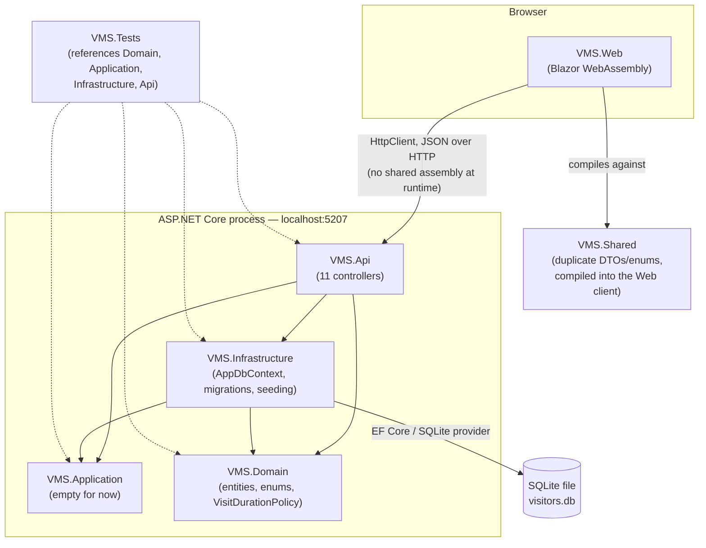
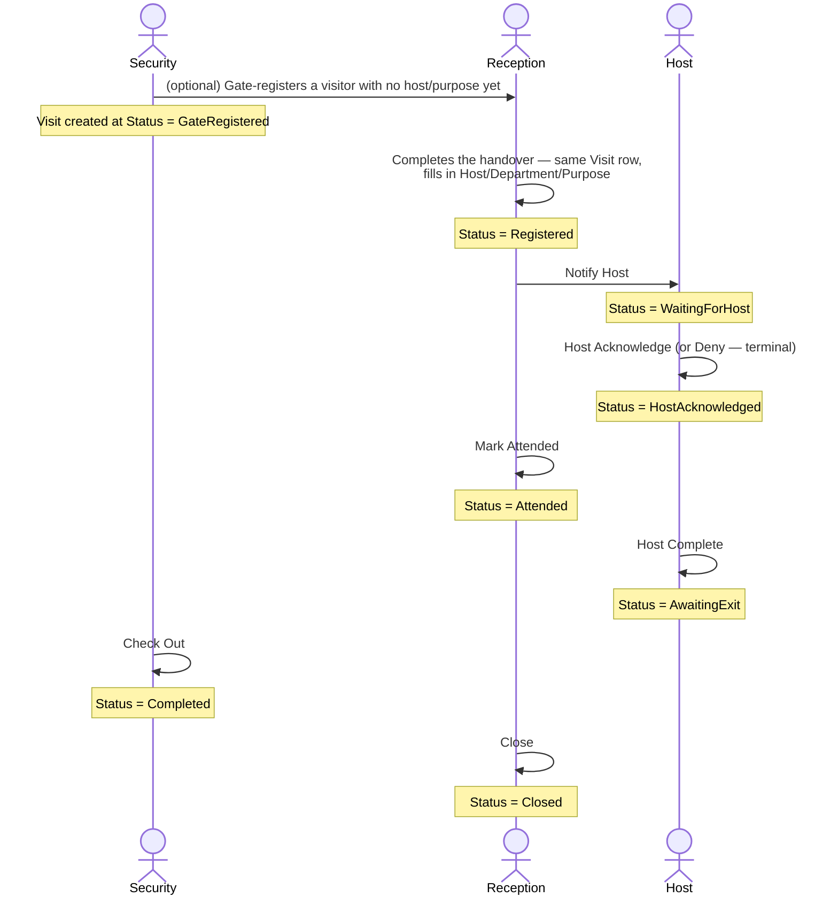

# Visitation Management System (VMS)

A visitor/gate-management application: a receptionist and a security desk register
visitors, notify the employee they're visiting ("the host"), track the visit through
acknowledgement → attendance → completion, and check the visitor back out — with a
full audit trail of every status change. Built as a Blazor WebAssembly client talking
to an ASP.NET Core Web API, backed by SQLite via EF Core.

This document is aimed at a developer opening this repo for the first time. It
explains what each project does, how the pieces talk to each other, how the core
business workflow actually works, how to run everything locally, and — the reason
this document exists right now — how to add and run automated tests in `VMS.Tests`.

---

## Table of contents

1. [Prerequisites & first-time setup](#1-prerequisites--first-time-setup)
2. [Tech stack](#2-tech-stack)
3. [Repository structure](#3-repository-structure)
4. [How the pieces fit together](#4-how-the-pieces-fit-together)
5. [The core domain: how a visit actually flows](#5-the-core-domain-how-a-visit-actually-flows)
6. [Authentication — read this before you get confused](#6-authentication--read-this-before-you-get-confused)
7. [Database, migrations, and seeding](#7-database-migrations-and-seeding)
8. [Running the app locally](#8-running-the-app-locally)
9. [Configuration](#9-configuration)
10. [Testing — VMS.Tests](#10-testing--vmstests)
11. [Conventions and things that will surprise you](#11-conventions-and-things-that-will-surprise-you)
12. [Where to look first](#12-where-to-look-first)

---

## 1. Prerequisites & first-time setup

### 1.1 What you need installed

| Requirement | Details |
|---|---|
| **.NET SDK 10** | This repo is built and tested against SDK **`10.0.301`**. Check yours with `dotnet --version`. If you don't have it, install from [dotnet.microsoft.com/download](https://dotnet.microsoft.com/download) — any `10.0.x` SDK should work; if you hit build errors that look SDK-related, matching the exact patch version is the first thing to try. |
| **Git** | To clone the repo. Nothing unusual. |
| **A terminal** | All commands below are plain `dotnet` CLI — no build scripts, no task runner. |

**Optional, only if you need them:**

| Tool | When you need it | Install |
|---|---|---|
| `dotnet-ef` (EF Core CLI) | Only if you're adding or applying a database migration (§7) — not needed just to run the app | `dotnet tool install --global dotnet-ef` |
| `sqlite3` CLI | Handy for peeking directly at the database to sanity-check seed data — not required, everything it's used for below can also be done through the app UI | Preinstalled on macOS and most Linux distros (`which sqlite3` to check); on Windows, install via `winget install SQLite.SQLite` or download from [sqlite.org](https://sqlite.org/download.html) |

**What you explicitly do *not* need**, since this stack sometimes gets confused with
a typical JS-heavy web project:

- **No Node.js / npm** — Blazor WebAssembly is compiled entirely from C# by the .NET
  SDK; there is no separate JS build step.
- **No Docker.**
- **No external/hosted database** — SQLite is a single file on disk, included via
  EF Core's SQLite provider; there's no server process to install or start.
- **No cloud account required to run the app** — the SMTP and Supabase-storage
  settings referenced in §9 back optional features (sending a confirmation email,
  uploading a photo). The app runs and the core visit workflow (§5) works fully
  without either configured; failures in those two integrations are caught and
  logged, not fatal.

**OS notes:** developed and tested on macOS. Nothing in the .NET/Blazor/EF Core
stack used here is macOS-specific, so Windows and Linux should behave identically
for running and developing the app day to day.

### 1.2 First-time setup, step by step

```bash
# 1. Clone and enter the repo
git clone <repo-url>
cd Visitation-Management-System

# 2. Confirm your SDK is compatible
dotnet --version
# should print 10.0.x

# 3. Restore + build everything — also the fastest way to confirm your
#    environment is set up correctly before you try to run anything
dotnet build
```

**4. Check whether the database is already seeded.** The SQLite database file
(`VMS.Infrastructure/Data/visitors.db`) is committed to this repo, so a fresh clone
gets the same data state as whoever last committed it — including, as of the current
commit, the demo `User` rows the mock-login system needs (§6). Verify this is still
true for the commit you're on before assuming it:

```bash
sqlite3 VMS.Infrastructure/Data/visitors.db "SELECT Id, FullName FROM Users;"
```

You should see 4 rows (`System Admin`, `Security Demo User`, `Host Demo User`,
`Sales Personnel Demo User`). **If you see fewer than 4 rows, or the command errors
because the table doesn't exist yet**, you need to run the seeder once — see the
full explanation and exact steps in §7. In short: temporarily uncomment the seeding
block near the bottom of `VMS.Api/Program.cs`, run the API once, confirm the console
prints `Demo user seed complete.`, then stop it. Skip this step entirely if step 4's
check already came back with 4 rows.

**5. Run the app** — two separate processes, two separate terminals:

```bash
# terminal 1
dotnet run --project VMS.Api      # http://localhost:5207

# terminal 2
dotnet run --project VMS.Web      # http://localhost:5100
```

**6. Open the app.** Go to `http://localhost:5100` in a browser, pick a role from
the login screen (Security, Receptionist, Host/Staff, or Sales Personnel — §6), and
you're in.

If a role-driven action fails with an error like *"acting user does not exist"* at
any point, that's the exact symptom of step 4's seeding not being in place — go back
and run it.

---

## 2. Tech stack

| Layer | Technology |
|---|---|
| Client | Blazor **WebAssembly** (runs entirely in the browser, no server-rendering) |
| API | ASP.NET Core Web API (.NET 10) |
| ORM | Entity Framework Core 10 |
| Database | SQLite (single file: `VMS.Infrastructure/Data/visitors.db`) |
| Email | MailKit (SMTP) |
| File storage | Supabase Storage client (declared, not fully wired — see §11) |
| Solution format | `VMS.slnx` — the new XML solution format, not classic `.sln` |
| Tests | xUnit (`VMS.Tests`, added for this project — see §10) |

Everything targets `net10.0` with `<Nullable>enable</Nullable>` and
`<ImplicitUsings>enable</ImplicitUsings>`.

---

## 3. Repository structure

```
Visitation-Management-System/
├── VMS.slnx                    ← the solution file (open this, not a .sln)
├── VMS.csproj                  ← stray leftover project, not referenced by anything, safe to ignore
│
├── VMS.Domain/                 ← entities, enums, one static business-rule class. No dependencies.
├── VMS.Application/            ← scaffolded for future use-case/orchestration code. Currently empty.
├── VMS.Infrastructure/         ← EF Core: DbContext, migrations, startup DB seeding.
├── VMS.Api/                    ← ASP.NET Core Web API — 11 controllers, all the business logic.
├── VMS.Shared/                 ← DTOs/enums duplicated for the Blazor client (see §11 — important gotcha).
├── VMS.Web/                    ← the actual UI. Blazor WebAssembly.
├── VMS.Tests/                  ← xUnit test project (new — see §10). Currently empty, waiting for tests.
│
└── test.http                   ← a manual REST Client scratch file — useful as a reference for
                                   every endpoint's request shape, not automated
```

### What lives in each project

**`VMS.Domain`** — the shared vocabulary. No project references at all (it's the
foundation everything else builds on).
- `Entities/` — 14 plain C# classes: `Visit`, `Visitor`, `Employee`, `Department`,
  `User`, `Role`, `Permission`, `RolePermission`, `VisitItem`, `VisitEquipment`,
  `VisitStatusHistory`, `Notification`, `AuditLog`, `ParkingSlot`,
  `ParkingReservation`. These are plain data holders — no methods, no validation
  logic on the entities themselves.
- `Enums/` — 13 enums (`VisitStatus`, `VisitPurposeType`, `BadgeStatus`, etc.)
- `Policies/VisitDurationPolicy.cs` — the one piece of real business logic living in
  this project: given a visit purpose and a host's job position, proposes how long
  the visit should be expected to last. **This is a pure static function with no
  dependencies — the best first thing to write a unit test against (see §10).**

**`VMS.Application`** — referenced by `VMS.Infrastructure` and `VMS.Api`, but
currently contains only the default template stub. If you're looking for
use-case/orchestration classes, they don't exist yet — that logic currently lives
directly inside the API controllers (see `VMS.Api` below).

**`VMS.Infrastructure`** — the persistence layer.
- `Data/AppDbContext.cs` — the `DbContext`. Every table's column types, max lengths,
  indexes, and foreign-key delete behavior are configured here in `OnModelCreating`.
  If you want to know the *actual current* shape of the database, read this file —
  it's more reliable than reading the migrations chronologically.
- `Data/AdminSeedRunner.cs` — two idempotent seed methods, `SeedEmployeePositionsAsync`
  and `SeedDemoUsersAsync`. See §7.
- `Migrations/` — two EF Core migrations so far.

**`VMS.Api`** — the HTTP surface. `Controllers/` has 11 controllers:
`VisitsController` (the big one — the entire visit lifecycle), `VisitorsController`,
`EmployeesController`, `DepartmentsController`, `ParkingSlotsController`,
`ParkingReservationsController`, `VisitItemsController`, `VisitEquipmentController`,
`NotificationsController`, `AuditLogsController`, `AnalyticsController`.
`Models/` holds the request/response DTOs, one file per resource area. `Services/`
has `EmailService` and `AuditLogService`.

**`VMS.Shared`** — a second copy of the DTOs and enums, compiled separately for the
Blazor client (which can't reference the server's assembly directly — see §11 for
why this matters and what to watch out for).

**`VMS.Web`** — the UI. `Pages/` is organized by feature area: `Visits/` (including
`Visits/Outbound/`), `Visitors/`, `Employees/`, `Security/` (including
`Security/Visitors/` — the gate-facing screens), plus `Login.razor`. `Services/` has
one `HttpClient`-backed service class per resource, injected in `Program.cs`.
`Auth/` is the entire mock-login system (§6). `Shared/` has reusable Razor
components (`StatusPill`, `Avatar`, `ConfirmDialog`, etc.).

**`VMS.Tests`** — xUnit, targets `net10.0`, project references to `VMS.Domain`,
`VMS.Application`, `VMS.Infrastructure`, and `VMS.Api`. See §10 for how to use it.

---

## 4. How the pieces fit together



**Important, non-obvious fact:** `VMS.Api` does **not** reference `VMS.Shared`. The
server's DTOs (`VMS.Api/Models/*.cs`) and the client's DTOs
(`VMS.Shared/Models/*.cs`) are two separately-compiled, hand-kept-in-sync copies —
they're only connected by the fact that both happen to serialize to the same JSON
shape. If you add or rename a field on one side, you almost always need to make the
matching edit on the other side too, or the build (or worse, a runtime
deserialization) breaks. This has genuinely caused build breaks in this repo's
history — see §11.

---

## 5. The core domain: how a visit actually flows

Everything in this app orbits one entity: `Visit` (`VMS.Domain/Entities/Visit.cs`).
Its `Status` field (`VisitStatus` enum) drives the whole UI — which buttons render,
what a receptionist sees on their list, what counts as "overdue."



A visit can also skip the gate entirely and be registered directly at
`Registered` (if a receptionist has the visitor's host/department/purpose up front),
and `Cancel` is available as a separate escape hatch from several early states — it's
not part of the linear chain above.

Every single one of these transitions is implemented the same way in
`VisitsController.cs`: load the visit → reject if the current status isn't the one
legal predecessor → check the acting user exists → mutate the row → write a
`VisitStatusHistory` entry → save → write an audit log entry → return the updated
visit. If you're trying to understand or test *any* status-changing behavior, that
file is where to look, and that five-step shape is what you're looking for in each
action method.

**`VisitDurationPolicy`** (`VMS.Domain/Policies/VisitDurationPolicy.cs`) is consulted
at registration time to propose an expected departure time, based on the visit's
purpose and (for "Official" business) the host's job position.

---

## 6. Authentication — read this before you get confused

**There is no real authentication in this system.** This is deliberate for the
current stage of the project, not a bug, but it will trip you up if you don't know
about it going in.

- `VMS.Web/Pages/Login.razor` shows four role cards: **Security**, **Receptionist**,
  **Admin** (labeled "Host / Staff" in the UI), and **Sales Personnel**.
- Clicking one calls `MockAuthService.LoginAsAsync(role)`
  (`VMS.Web/Auth/MockAuthService.cs`), which looks up a fixed permission set and a
  fixed `ActorId` for that role from `MockRoleCatalog`
  (`VMS.Web/Auth/MockAuthModels.cs`), and writes it straight into the browser's
  `localStorage`. That's the entire "login."
- Every page checks `MockAuth.HasPermission("some.permission.string")` to decide
  what to render. **This check only exists client-side.** The API has no
  `[Authorize]` attributes anywhere.
- When the UI calls the API to do something (check someone in, acknowledge a host
  visit, etc.), it sends the current role's `ActorId` as a plain integer in the
  request body. The API's only check is "does a `User` row with this exact ID
  exist" — it does **not** verify that the caller actually is that user.

**Why this matters practically:** those fixed `ActorId` values (Security=2,
Receptionist=1, Admin=3, SalesPersonnel=4) must correspond to real rows in the
`Users` table, or every status-changing action will fail with a 400 "acting user
does not exist." That's exactly what §7's seeding section is about.

If/when real authentication gets built, the natural place to wire it in is already
sitting unused in the database: `Role`, `Permission`, and `RolePermission` are a
fully-migrated RBAC schema that no controller currently reads.

---

## 7. Database, migrations, and seeding

**Database:** a single SQLite file at `VMS.Infrastructure/Data/visitors.db`, resolved
to an absolute path at API startup (`VMS.Api/Program.cs`). The connection string
lives in `VMS.Api/appsettings.json` under `ConnectionStrings:DefaultConnection`.

**Migrations:** two so far, in `VMS.Infrastructure/Migrations/`. To add a new one
after changing an entity or `AppDbContext.OnModelCreating`:

```bash
# from the repo root
dotnet ef migrations add DescriptiveNameHere --project VMS.Infrastructure --startup-project VMS.Api
dotnet ef database update --project VMS.Infrastructure --startup-project VMS.Api
```

(You'll need the EF Core CLI tool once: `dotnet tool install --global dotnet-ef`.)

**Seeding — the part most likely to trip up a fresh clone:** `AdminSeedRunner.cs`
has two idempotent seed methods (safe to run repeatedly — they check for existing
rows before inserting):

- `SeedEmployeePositionsAsync` — seeds a handful of demo employees.
- `SeedDemoUsersAsync` — seeds the `User` rows that the mock-login `ActorId`s
  (§6) depend on.

**As of this writing, both seed calls are commented out** in `VMS.Api/Program.cs`,
just above `app.UseCors(...)`:

```csharp
// using (var scope = app.Services.CreateScope())
// {
//     var context = scope.ServiceProvider.GetRequiredService<AppDbContext>();
//     await AdminSeedRunner.SeedDemoUsersAsync(context);
//     Console.WriteLine("Demo user seed complete.");
// }
```

If you're working against a fresh `visitors.db` (or a teammate's DB that's never had
this run), **uncomment that block, run the API once, then re-comment it if you don't
want it running on every startup.** You can check whether it's needed with:

```bash
sqlite3 VMS.Infrastructure/Data/visitors.db "SELECT Id, FullName FROM Users;"
```

If that returns fewer than 4 rows, the demo users aren't fully seeded and
role-driven actions (host-acknowledge, checkout, etc.) will fail with "acting user
does not exist" until you fix that.

---

## 8. Running the app locally

Two separate processes, two separate terminals:

```bash
dotnet run --project VMS.Api      # http://localhost:5207
dotnet run --project VMS.Web      # http://localhost:5100
```

`VMS.Web` reads the API's base URL from `VMS.Web/wwwroot/appsettings.json`
(`ApiBaseUrl`), currently hardcoded to `http://localhost:5207/` — there's no
environment-specific override, so if you change the API's port, update that file
too.

Both projects also have `launchSettings.json` under `Properties/` if you prefer
running via an IDE's "Run" button instead of the CLI.

---

## 9. Configuration

| File | What's in it |
|---|---|
| `VMS.Api/appsettings.json` | DB connection string, SMTP settings for outbound email |
| `VMS.Web/wwwroot/appsettings.json` | API base URL, Supabase storage config |
| `VMS.Api/Properties/launchSettings.json`, `VMS.Web/Properties/launchSettings.json` | Dev launch profiles / ports |

**Do not commit real credentials into `appsettings.json`.** This repo currently has
no `.gitignore`, so anything written to these files is tracked. If you need to test
against real SMTP or storage credentials locally, prefer `dotnet user-secrets` or an
untracked local override file over editing the tracked `appsettings.json` directly.

---

## 10. Testing — VMS.Tests

The `VMS.Tests` project exists and is wired up (xUnit, references to `VMS.Domain`,
`VMS.Application`, `VMS.Infrastructure`, `VMS.Api`) but currently has **zero test
files in it** — it's a clean starting point, not a project with existing coverage to
extend.

### Running tests

```bash
# run everything in the project
dotnet test VMS.Tests/VMS.Tests.csproj

# run everything in the whole solution (any test project VS gets picked up)
dotnet test

# run a single test by name
dotnet test VMS.Tests/VMS.Tests.csproj --filter "FullyQualifiedName~VisitDurationPolicyTests"

# with coverage (coverlet is already referenced in the .csproj)
dotnet test VMS.Tests/VMS.Tests.csproj --collect:"XPlat Code Coverage"
```

### Adding your first test

Create a file under `VMS.Tests/` — mirror the folder structure of what you're
testing if it helps (e.g. `VMS.Tests/Domain/Policies/VisitDurationPolicyTests.cs`),
but a flat structure is fine too for a project this size. Name the file
`<WhatYouAreTesting>Tests.cs` and the class the same.

**The best place to start** is `VisitDurationPolicy`
(`VMS.Domain/Policies/VisitDurationPolicy.cs`) — it's a pure static method, no
database, no HTTP, nothing to mock:

```csharp
using VisitorManagementSystem.Domain.Enums;
using VisitorManagementSystem.Domain.Policies;
using Xunit;

namespace VMS.Tests.Domain.Policies;

public class VisitDurationPolicyTests
{
    [Fact]
    public void OfficialMeeting_host_is_DirectorGeneral_proposes_four_hours()
    {
        var duration = VisitDurationPolicy.TryGetProposedDuration(
            VisitPurposeType.OfficialMeeting, "DirectorGeneral");

        Assert.Equal(TimeSpan.FromHours(4), duration);
    }

    [Fact]
    public void Unrecognized_purpose_returns_null()
    {
        var duration = VisitDurationPolicy.TryGetProposedDuration(
            VisitPurposeType.Personal, "Officer");

        Assert.Null(duration);
    }
}
```

### Where to go from there, roughly in order of value

1. **`VisitDurationPolicy`** (above) — pure function, zero setup.
2. **The `VisitStatus` transition rules** — currently expressed as inline `if`
   checks inside each action in `VisitsController.cs` (e.g. `HostComplete` only
   allowed when `Status == Attended`). These aren't extracted into a standalone,
   easily-unit-testable class yet, so testing them today means either (a) an
   integration-style test that spins up the controller with a real/in-memory
   `AppDbContext`, or (b) extracting the transition table into `VMS.Domain` first so
   it becomes a pure function like `VisitDurationPolicy` — worth considering if
   you're about to write several of these tests.
3. **Integration tests against `VisitsController`** — for testing real HTTP
   behavior (status codes, validation responses) end to end. This needs
   `Microsoft.AspNetCore.Mvc.Testing`, which isn't referenced yet:
   ```bash
   dotnet add VMS.Tests/VMS.Tests.csproj package Microsoft.AspNetCore.Mvc.Testing
   ```
   Then use `WebApplicationFactory<Program>` to spin up `VMS.Api` in-process
   against a temporary SQLite database (don't point tests at the real
   `visitors.db`). Note: because of the `User`-row dependency described in §6/§7,
   any test that calls a status-changing endpoint needs its test database seeded
   with matching `User` rows first, or you'll hit the same "acting user does not
   exist" error real usage does.
4. **`AppDbContext` / EF Core configuration tests** — e.g. asserting a unique-index
   violation actually throws, or that a `Restrict`-delete FK behaves as expected.
   Useful, lower priority than the two above.

`test.http` (repo root) is a good reference while writing integration tests — it
documents every endpoint's expected request/response shape, including a note about
the exact `ActorId` dependency described in §6.

---

## 11. Conventions and things that will surprise you

A few things that aren't bugs, but will look like bugs if you don't know they're
intentional (or at least, known-and-accepted-for-now):

- **The DTO/enum duplication between `VMS.Api/Models` and `VMS.Shared/Models`**
  (§4). If you change a field on one, check whether the other needs the same
  change. This is the single most common source of "why won't this build" surprises
  in this repo.
- **`VisitPurposeType` has deliberately duplicated enum values** — e.g.
  `OfficialMeeting = 1` and `Meeting = 1` are the *same* underlying value on purpose,
  so a label can be renamed without a database migration. See the comment in
  `VMS.Web/Shared/EnumLabels.cs`. If you're adding a new purpose, add a new number;
  don't reuse an existing one unless you specifically mean to alias it.
- **The Outbound Visits module (`VMS.Web/Pages/Visits/Outbound/`) is not backed by
  a real database.** `IOutboundVisitService` is wired to `MockOutboundVisitService`
  (an in-memory fake) in `VMS.Web/Program.cs` — every other service in that file is
  backed by a real API call, this one isn't. Don't be surprised when outbound-visit
  data disappears on a browser refresh; there's no `OutboundVisitsController` or
  database table backing it yet.
- **No pagination anywhere in the API.** Every list endpoint (`GET /api/Visits`,
  `GET /api/Visitors`, etc.) returns the entire table. Fine at demo data volumes,
  worth knowing before you assume a list endpoint scales.
- **No background jobs, no real-time updates.** If two people have the same visit
  open in two browser tabs, neither sees the other's change without a manual
  refresh. There's also no automatic "visit is now overdue" alert — overdue status
  is computed live, on demand, when the dashboard is loaded (`AnalyticsController`),
  not pushed to anyone.
- **Every foreign key in the schema is `DeleteBehavior.Restrict`** except
  `VisitEquipment→Visit`, which cascades. Trying to delete a row that something
  else still references will throw a `DbUpdateException` rather than quietly
  cascading — this is deliberate (don't accidentally lose audit history), but it
  means delete actions in the API can surface as a raw 500 if the calling code
  doesn't catch it.

---

## 12. Where to look first

If you're getting oriented for the first time, read in this order:

1. `VMS.Domain/Entities/Visit.cs` — the entity everything revolves around.
2. `VMS.Domain/Enums/VisitStatus.cs` — the states that drive the whole app.
3. `VMS.Web/Auth/MockAuthModels.cs` — understand immediately that login is mocked.
4. `VMS.Api/Controllers/VisitsController.cs`, top to bottom — this one file *is*
   the application's core business logic.
5. Run both processes (§8), log in as each of the four demo roles, and walk one
   visit through the full lifecycle by hand (§5) — switching roles as needed, since
   no single role can do it end to end alone.
6. Then start on §10 above.
